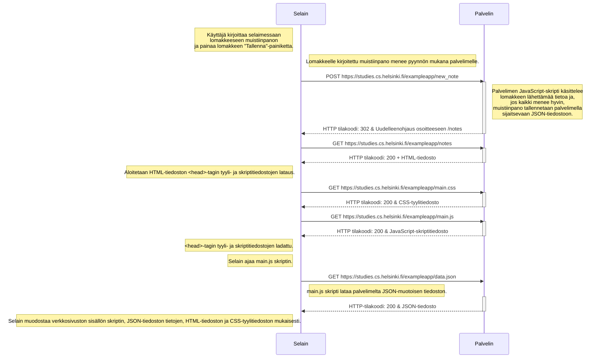

```mermaid
sequenceDiagram
    participant Selain
    participant Palvelin
    
    Note left of Selain: Käyttäjä kirjoittaa selaimessaan<br>lomakkeeseen muistiinpanon<br>ja painaa lomakkeen "Tallenna"-painiketta.
    
    Note right of Selain: Lomakkeelle kirjoitettu muistiinpano menee pyynnön mukana palvelimelle.
    Selain->>Palvelin: POST https://studies.cs.helsinki.fi/exampleapp/new_note
    activate Palvelin
    Note right of Palvelin: Palvelimen JavaScript-skripti käsittelee<br>lomakkeen lähettämää tietoa ja,<br>jos kaikki menee hyvin,<br>muistiinpano tallennetaan palvelimella<br>sijaitsevaan JSON-tiedostoon.
    Palvelin-->>Selain: HTTP tilakoodi: 302 & Uudelleenohjaus osoitteeseen /notes
    deactivate Palvelin
    
    Selain->>Palvelin: GET https://studies.cs.helsinki.fi/exampleapp/notes
    activate Palvelin
    Palvelin-->>Selain: HTTP tilakoodi: 200 + HTML-tiedosto
    deactivate Palvelin
    
    Note left of Selain: Aloitetaan HTML-tiedoston <head>-tagin tyyli- ja skriptitiedostojen lataus.
    
    Selain->>Palvelin: GET https://studies.cs.helsinki.fi/exampleapp/main.css
    activate Palvelin
    Palvelin-->>Selain: HTTP tilakoodi: 200 & CSS-tyylitiedosto
    deactivate Palvelin
    
    Selain->>Palvelin: GET https://studies.cs.helsinki.fi/exampleapp/main.js
    activate Palvelin
    Palvelin-->>Selain: HTTP tilakoodi: 200 & JavaScript-skriptitiedosto
    deactivate Palvelin
    
    Note left of Selain: <head>-tagin tyyli- ja skriptitiedostojen ladattu.
    
    Note left of Selain: Selain ajaa main.js skriptin.
    
    Selain->>Palvelin: GET https://studies.cs.helsinki.fi/exampleapp/data.json
    Note right of Selain: main.js skripti lataa palvelimelta JSON-muotoisen tiedoston.
    activate Palvelin
    Palvelin-->>Selain: HTTP-tilakoodi: 200 & JSON-tiedosto
    deactivate Palvelin
    
    Note left of Selain: Selain muodostaa verkkosivuston sisällön skriptin, JSON-tiedoston tietojen, HTML-tiedoston ja CSS-tyylitiedoston mukaisesti.
```
