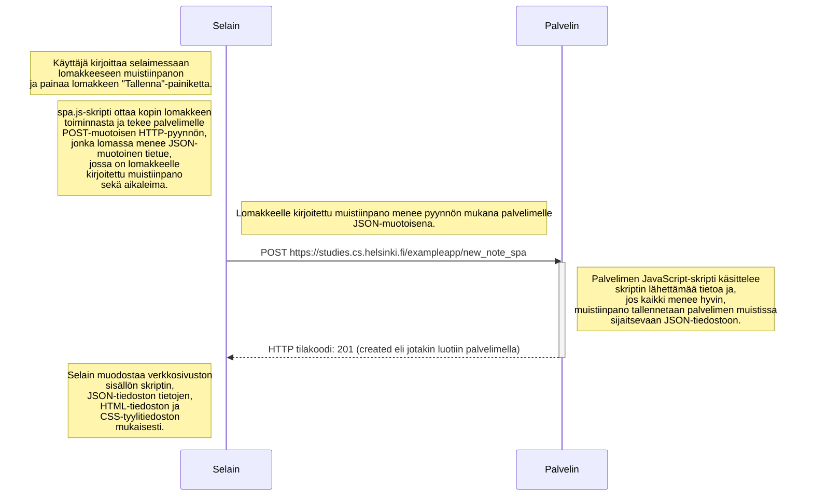

```mermaid
sequenceDiagram
    participant Selain
    participant Palvelin
    
    Note left of Selain: Käyttäjä kirjoittaa selaimessaan<br>lomakkeeseen muistiinpanon<br>ja painaa lomakkeen "Tallenna"-painiketta.
    Note left of Selain: spa.js-skripti ottaa kopin lomakkeen<br>toiminnasta ja tekee palvelimelle<br>POST-muotoisen HTTP-pyynnön,<br>jonka lomassa menee JSON-<br>muotoinen tietue,<br>jossa on lomakkeelle<br>kirjoitettu muistiinpano<br>sekä aikaleima.
    
    Note right of Selain: Lomakkeelle kirjoitettu muistiinpano menee pyynnön mukana palvelimelle<br>JSON-muotoisena.
    Selain->>Palvelin: POST https://studies.cs.helsinki.fi/exampleapp/new_note_spa
    activate Palvelin
    Note right of Palvelin: Palvelimen JavaScript-skripti käsittelee<br>skriptin lähettämää tietoa ja,<br>jos kaikki menee hyvin,<br>muistiinpano tallennetaan palvelimen muistissa<br>sijaitsevaan JSON-tiedostoon.
    Palvelin-->>Selain: HTTP tilakoodi: 201 (created eli jotakin luotiin palvelimella)
    deactivate Palvelin
    
    Note left of Selain: Selain muodostaa verkkosivuston<br>sisällön skriptin,<br>JSON-tiedoston tietojen,<br>HTML-tiedoston ja<br>CSS-tyylitiedoston<br>mukaisesti.
```
