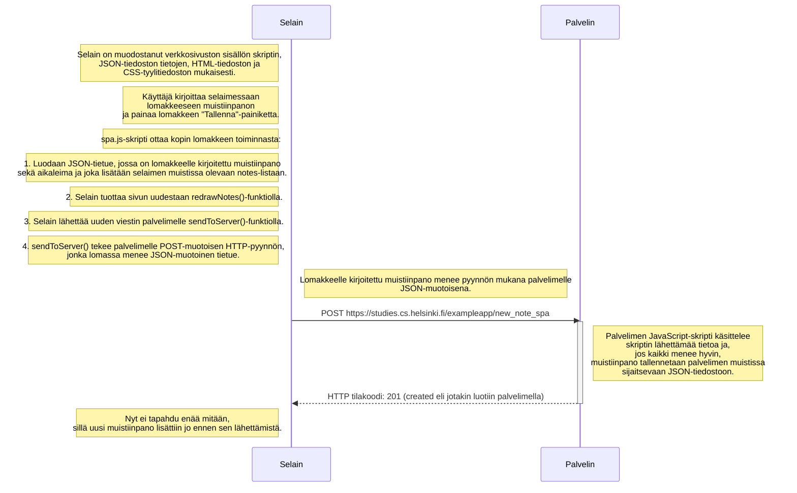

PS. Käyttäjän on siis luultavasti päivitettävä sivunsa uudestaan itse, jos haluaa saada uudet viestit palvelimelta, sillä spa.js ei näytä sisältävän automaattista sivun virkistystä missää kohdassa. JavaScript-taitoni ovat ruosteessa, joten en ole aivan varma tästä loppupäätelmästä.
