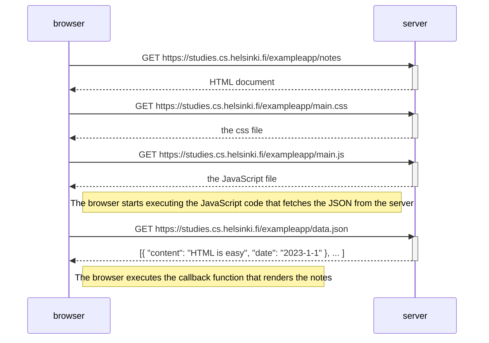

Kopioidaan suoraan tehtävän esimerkki sivulta https://fullstack-hy.github.io/osa0/web_sovelluksen_toimintaperiaatteita#single-page-app

Githubin ohje mermaidiin: https://docs.github.com/en/get-started/writing-on-github/working-with-advanced-formatting/creating-diagrams

Eli `mermaid`-tagit vain lisään annettuun esimerkkiin.

### Koodi
    ```mermaid
    sequenceDiagram
        participant browser
        participant server

        browser->>server: GET https://studies.cs.helsinki.fi/exampleapp/notes
        activate server
        server-->>browser: HTML document
        deactivate server

        browser->>server: GET https://studies.cs.helsinki.fi/exampleapp/main.css
        activate server
        server-->>browser: the css file
        deactivate server

        browser->>server: GET https://studies.cs.helsinki.fi/exampleapp/main.js
        activate server
        server-->>browser: the JavaScript file
        deactivate server

        Note right of browser: The browser starts executing the JavaScript code that fetches the JSON from the server

        browser->>server: GET https://studies.cs.helsinki.fi/exampleapp/data.json
        activate server
        server-->>browser: [{ "content": "HTML is easy", "date": "2023-1-1" }, ... ]
        deactivate server    

        Note right of browser: The browser executes the callback function that renders the notes 
    ```

### Lopputulos

